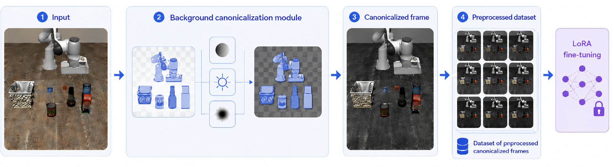
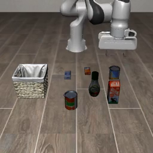
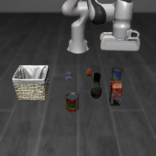
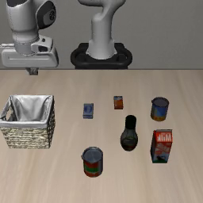
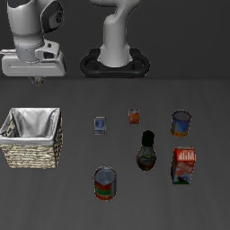

# Background Canonicalization for Vision-Language-Action Models

<p align="center">
  
</p>

Background **canonicalization / masking** on top of [VLA-Adapter](https://github.com/OpenHelix-Team/VLA-Adapter)
to make robot manipulation policies robust to background perturbations (LIBERO / LIBERO-PRO).
Cluttered backgrounds are canonicalized into a clean, consistent scene before the frames are used to LoRA fine-tune the policy.

> ⚠️ This repository contains **code and evaluation results only**.
> Pretrained weights, datasets, and the virtual environment are **not included** (see [Not Included](#not-included)).

---

## Pipeline

1. **Input** — raw observation with a cluttered/perturbed background
2. **Background canonicalization module** — segment foreground objects and replace the background with a canonical one
3. **Canonicalized frame** — clean, consistent scene
4. **Preprocessed dataset** — a dataset of canonicalized frames
5. **LoRA fine-tuning** — fine-tune the VLA policy on the canonicalized data

---

## Installation

```bash
# 1. Clone this repo
git clone https://github.com/KDIAMN/Background_Canonicalization_Vision-Language-Action.git
cd Background_Canonicalization_Vision-Language-Action

# 2. Create environment (Python 3.10)
conda create -n vla python=3.10 -y
conda activate vla

# 3. Install the VLA-Adapter codebase dependencies
pip install -e models/VLA-Adapter
# torch 2.2.0 + cu121 (adjust to your CUDA version)
```

External repos to clone separately:
- [VLA-Adapter](https://github.com/OpenHelix-Team/VLA-Adapter)
- [LIBERO](https://github.com/Lifelong-Robot-Learning/LIBERO)
- [LIBERO-PRO](https://github.com/Zxy-MLlab/LIBERO-PRO)

---

## Quick Start

```bash
# Fine-tune (background-masked)
bash script/finetune_bg_masked_libero_object.sh

# Evaluate
python eval/libero_object_eval/run_libero_eval.py
```

> Absolute paths in the scripts are placeholders. Replace them first:
> ```bash
> grep -rl "/path/to/VLA_Adapter" . | xargs sed -i 's#/path/to/VLA_Adapter#<your_path>#g'
> ```

---

## Background Masking Examples

| Original | Background-Masked |
|:---:|:---:|
|  |  |
|  |  |

---

## Repository Structure

| Folder | Contents |
|---|---|
| `models/VLA-Adapter/` | Core training/inference code (with modifications) |
| `eval/` | Evaluation scripts + result logs + sample videos |
| `script/` | Run scripts (`*.sh`), LoRA merge, reproduction notes |
| `datasets/FT_dataset_augment/` | Dataset conversion scripts |
| `sample_image/` | Before/after background-masking samples |

## Not Included

- **Weights** (~17 GB): GroundingDINO, SAM2, VLA-Adapter base — download from official sources
- **Datasets** (RLDS) and the **virtual environment**

---

## Environment

- Python 3.10 / torch 2.2.0+cu121
- Dependencies: see `models/VLA-Adapter/pyproject.toml` and `models/VLA-Adapter/our_envs.txt`

---

## Acknowledgements

Built on [VLA-Adapter](https://github.com/OpenHelix-Team/VLA-Adapter) (OpenHelix-Team).
Modifications: `bfloat16 → float16`, optional proprioception support.
